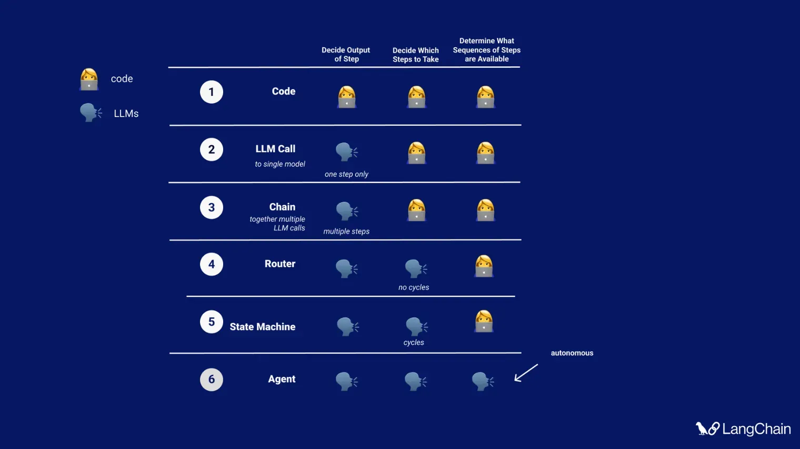

Reflection agents
==================

Understanding how to perform Self-reflection in prompting.

---

#### poetry useful commands
```commandline
mkdir reflection_agents
cd reflection_agents

poetry init --name reflection-agents --author "Ayush-Nema <contact.ayushnema@gmail.com>" --python ">=3.11,<4.0" --no-interaction

poetry add python-dotenv@">=1.1.0,<2.0.0" \
            langchain@">=0.3.23,<0.4.0" \
            langchain-openai@">=0.3.12,<0.4.0" \
            langgraph@">=0.3.27,<0.4.0"

poetry add --group dev black@">=25.1.0,<26.0.0" isort@">=6.0.1,<7.0.0"
```


  
Point 1-4: General scope of `LangChain`  
Point 5: `LangGraph` supremacy  
Point 6: Full autonomous agent

